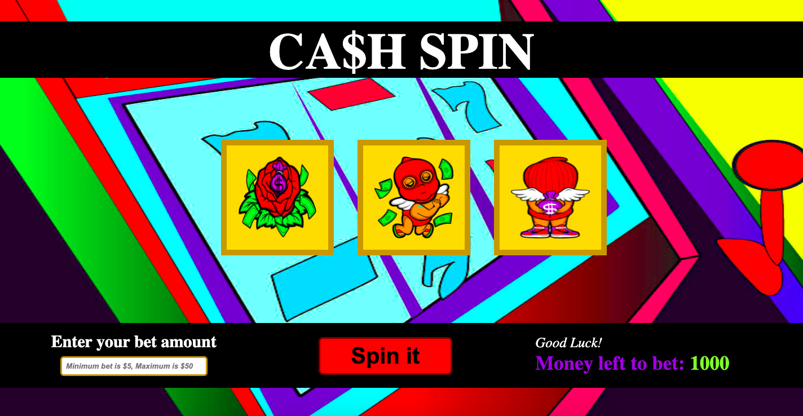

## Slot Machine
This is a project where users can enter a bet amount, spin the slotmachine, and receive a randomized pairing of the reels. Users will be able to see the amount betted either subtracted or added to their total monies. Users will also be able to see if they won or lost.

Link to project:

## How It's Made:
Tech used: HTML, CSS, JavaScript

This project was really fun to make and conceptualize. My entire family lives and breathes for gambling, so it felt cute to take a step back and think, "wow someday I can engineer all the things that were apart of my family's experience in this country." 

## Lessons Learned:
I really wanted to learn how to rotate the slots, but I could not figure it out. I was dissapointed in that inability, but very much looking forward to attempting that function for the next project. 
